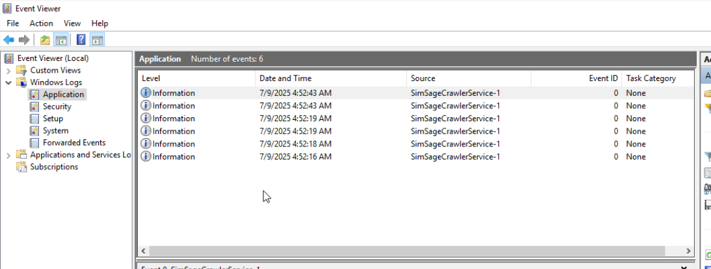
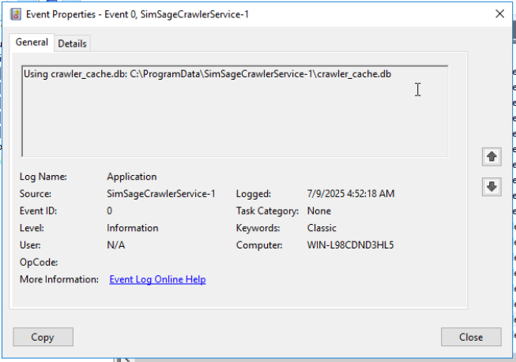
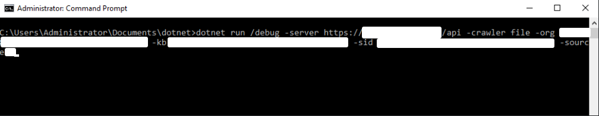
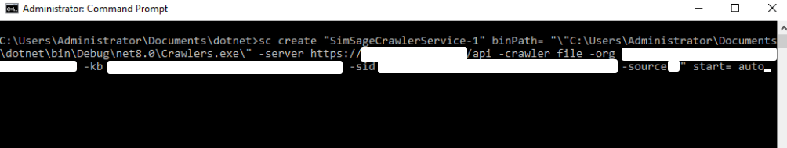
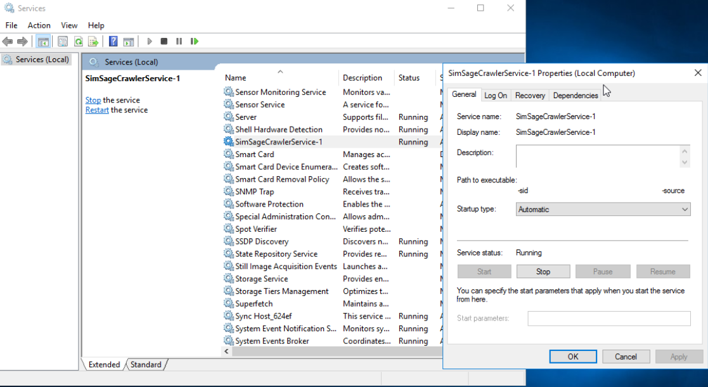
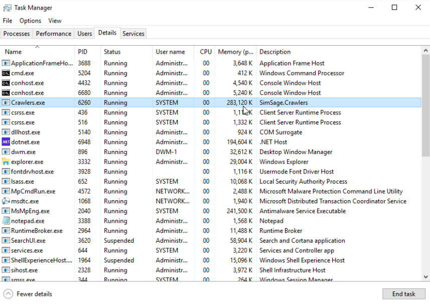

# SimSage dotnet Windows File Crawler

A Windows file-crawler that can run as a service or as a console application for testing.
This crawler will connect on a Windows machine to a file-share present on that machine (e.g. `\\server\share-name\path`).
These details are configured through the SimSage admin-UI.  Make sure to map this file-share 
on the machine this service is running on/from.

## install dotnet

```bash
# arch linux
sudo pacman -S dotnet-sdk-8.0
```

```powershell

# modern Windows servers
#
winget install Microsoft.DotNet.AspNetCore.8
# desktop instead use: 
# winget install Microsoft.DotNet.DesktopRuntime.8

# and always install the runtime
winget install Microsoft.DotNet.Runtime.8

# or download the SDK and RunTime from Microsoft
#
# sdk
https://dotnet.microsoft.com/en-us/download/dotnet/thank-you/sdk-8.0.317-windows-x64-installer
# runtime
https://dotnet.microsoft.com/en-us/download/dotnet/thank-you/runtime-8.0.20-windows-x64-installer

# verifiy installation
dotnet --list-runtimes
```

## compile and build
restore, clean and build, for --arch x86 (32-bit Windows) 
```
dotnet restore
dotnet clean
# 32 bit version
dotnet build --arch x86 --no-incremental /property:GenerateFullPaths=false

# 64 bit version
dotnet build --arch x86 --configuration Release --no-incremental /property:GenerateFullPaths=false
cd src/Crawlers/bin/Release/net8.0/

# to run see run from console below
```

## run
This code has been designed to run as a Windows-Service or as a command-line utility.

### install as a service
```
# NB. the spaces after equal signs below (= ) are required!
# the quotes within quotes for the path are only required if that path has spaces in it
# these are just sample values - make sure to get your values from your SimSage instance
sc create "SimSageCrawlerService-1" binPath= "\"C:\Path\To\Your\Crawlers.exe\" \
    -server http://localhost:8080/api -crawler file \
    -org xxxxxxxx-xxxx-xxxx-xxxx-xxxxxxxxxxxx \
    -kb xxxxxxxx-xxxx-xxxx-xxxx-xxxxxxxxxxxx \
    -sid xxxxxxxx-xxxx-xxxx-xxxx-xxxxxxxxxxxx \
    -aes xxxxxxxxxxxxxxxxxxxxxxxxxxxxxxxxxxxx \
    -source 5" DisplayName= "SimSage FileCrawler Service 1" start= auto

# and remove it
sc delete "SimSageCrawlerService-1"
```

### run from the console
```
# do not use /install from the console!  it doesn't work - use sc.exe (see above)
# these are just sample values - make sure to get your values from your SimSage instance
Crawlers /debug -server http://localhost:8080/api -crawler file -org xxxxxxxx-xxxx-xxxx-xxxx-xxxxxxxxxxxx \
    -kb xxxxxxxx-xxxx-xxxx-xxxx-xxxxxxxxxxxx -sid xxxxxxxx-xxxx-xxxx-xxxx-xxxxxxxxxxxx \
    -source 5 -aes xxxxxxxxxxxxxxxxxxxxxxxxxxxxxxxxxxxx
```

### parameters
| **Parameter**   | **Value**                              | **Explanation**                                                           |
|:----------------|:---------------------------------------|:--------------------------------------------------------------------------|
| `-server`       | `http://localhost:8080/api`            | The base URL of the API server for the SimSage platform to interact with. |
| `-crawler`      | `file`                                 | Specifies the type of crawler, for now only the file-based crawler.       |
| `-org`          | `xxxxxxxx-xxxx-xxxx-xxxx-xxxxxxxxxxxx` | GUID identifier for the organization associated with the crawler.         |
| `-kb`           | `xxxxxxxx-xxxx-xxxx-xxxx-xxxxxxxxxxxx` | GUID identifier for the knowledge base the crawler is targeting.          |
| `-sid`          | `xxxxxxxx-xxxx-xxxx-xxxx-xxxxxxxxxxxx` | GUID security ID for the current crawling operation.                      |
| `-aes`          | `xxxxxxxxxxxxxxxxxxxxxxxxxxxxxxxxxxxx` | The SimSage platform AES key for data encryption/decryption.              |
| `-source`       | `5`                                    | Identifier for the data source to connect to by the crawler.              |
| `-encryption`   | (Flag)                                 | Enables encryption for data transport.  Currently not supported.          |
| `-noselfsigned` | (Flag)                                 | Disables the acceptance of self-signed SSL certificates.                  |
| `-exitwhendone` | (Flag)                                 | Instructs the crawler to exit once all crawling tasks are completed.      |
| `-disablecache` | (Flag)                                 | Disables the default Sqlite caching mechanisms within the crawler.        |

### Windows service














### Utilities and Development tools
Install VS Code after you've installed Dotnet 8

```shell
# visual studio code
https://code.visualstudio.com/download

# install C# Dev Kit (Microsoft) by opening any C# file
https://git-scm.com/downloads/win

# clone this repository
git clone git@github.com:simsage/dotnet-crawler.git

cd dotnet-crawler
dotnet restore
```
